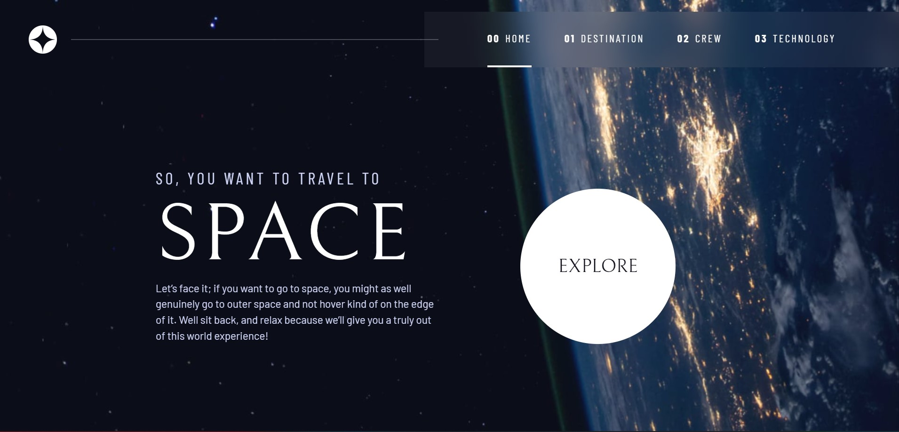

# Frontend Mentor - Space tourism website solution

This is a solution to the [Space tourism website challenge on Frontend Mentor](https://www.frontendmentor.io/challenges/space-tourism-multipage-website-gRWj1URZ3). Frontend Mentor challenges help you improve your coding skills by building realistic projects.

## Table of contents

- [The challenge](#the-challenge)
- [Screenshot](#screenshot)
- [Links](#links)
- [My process](#my-process)
- [Built with](#built-with)
- [What I learned](#what-i-learned)
- [Continued development](#continued-development)
- [Author](#author)
- [Acknowledgments](#acknowledgments)

## The challenge

Users should be able to:

- View the optimal layout for each of the website's pages depending on their device's screen size
- See hover states for all interactive elements on the page
- View each page and be able to toggle between the tabs to see new information

## Screenshot

## Links

- Solution URL: [Github](https://github.com/tientrinh21/space-tourism-website)
- Live Site URL: [Netlify](https://space-tourism-website-tientrinh.netlify.app/)

## Built with

- Semantic HTML5 markup
- CSS custom properties
- Mobile-first workflow
- Vanilla JS

## What I learned

- Custom CSS properties
- How to organize css files

## Continued development

Remodified using React & Next.js

## Author

- Website - [Tien Trinh](https://tientrinh.netlify.app/)
- Frontend Mentor - [@tientrinh21](https://www.frontendmentor.io/profile/tientrinh21)

## Acknowledgments

- [Kevin Powell](https://www.youtube.com/kepowob)
